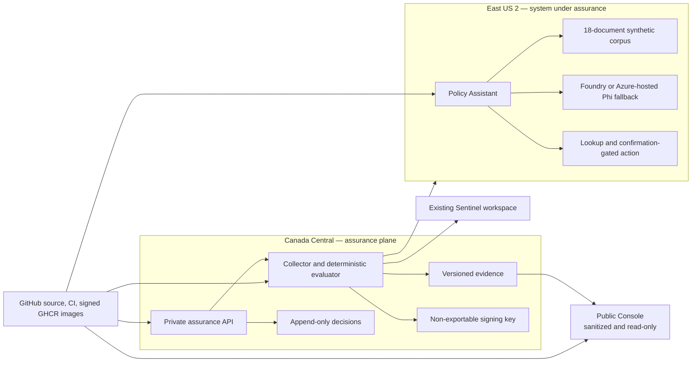

# Azure AI Continuous Assurance

[](https://github.com/ymangt/azure-ai-continuous-assurance/actions/workflows/ci.yml)
[](https://github.com/ymangt/azure-ai-continuous-assurance/actions/workflows/security.yml)
[](https://github.com/ymangt/azure-ai-continuous-assurance/actions/workflows/supply-chain.yml)

An evidence-first continuous internal-assurance and audit-readiness simulation for a small Azure-hosted AI policy assistant. It connects cloud configuration, identity, CI, telemetry, and controlled AI evaluations to traceable control conclusions, findings, risks, remediation records, retests, reports, and signed OSCAL packages.

> **Important scope statement:** this is an internal-readiness portfolio project, not a certification, attestation, penetration test, production authorization, or independent audit. The organizations, people, policies, incidents, tickets, prompts, and attack scenarios are synthetic. One author simulates several audit and management roles.

## Contents

- [Start here: what the project does](#start-here-what-the-project-does)
- [Assurance concepts in plain language](#assurance-concepts-in-plain-language)
- [What is implemented](#what-is-implemented)
- [Product surfaces](#product-surfaces)
- [Run the project locally](#run-the-project-locally)
- [Assurance Console page guide](#assurance-console-page-guide)
- [What Queue assessment actually does](#what-queue-assessment-actually-does)
- [Policy Assistant guide](#policy-assistant-guide)
- [A complete example: criteria to retest](#a-complete-example-criteria-to-retest)
- [Architecture and security model](#architecture-and-security-model)
- [CLI and validation](#cli-and-validation)
- [Repository map](#repository-map)
- [Current release level and limitations](#current-release-level-and-limitations)
- [How to explain this project in an interview](#how-to-explain-this-project-in-an-interview)
- [Further reading](#further-reading)

## Start here: what the project does

Traditional audits are periodic: an assessor asks for evidence, tests requirements, documents gaps, and issues a report. Continuous assurance applies the same reasoning repeatedly and more automatically.

This project asks:

> Can the system repeatedly collect trustworthy evidence, apply explicit test criteria, preserve failures, track remediation, retest with fresh evidence, and produce a package another person can verify?

The central chain is:

```mermaid
flowchart LR
  Scope["1. Define system and scope"] --> Control["2. Select control objective"]
  Control --> Test["3. Run procedure"]
  Test --> Evidence["4. Bind fresh evidence"]
  Evidence --> Result["5. Record PASS / FAIL / ERROR"]
  Result --> Finding["6. Document finding"]
  Finding --> Risk["7. Score and treat risk"]
  Risk --> Remediation["8. Record remediation"]
  Remediation --> Retest["9. Collect new evidence and retest"]
  Retest --> Decision["10. Human closure or reopen decision"]
```



The browser is a workbench for reading those records and submitting commands. It does **not** collect Azure evidence, decide control results, silently rewrite signed history, approve its own findings, or grant real access.

## Assurance concepts in plain language

If you have used a vulnerability scanner or SIEM, the following mapping is useful:

| Assurance term | Plain meaning | Familiar security analogy |
|---|---|---|
| Scope / system boundary | Exactly what is and is not being assessed | The hosts, accounts, applications, and networks included in a scan |
| Control | A safeguard or requirement category | “Restrict administrative access” |
| Control objective | A specific, testable statement tailored to this system | “No attached NSG allows Internet RDP or SSH” |
| Procedure / method | How the objective is assessed: examine, interview, test, or a combination | An SPL query, configuration check, negative API test, or manual review |
| Criteria | What should be true | The secure baseline or policy requirement |
| Condition | What the evidence shows is actually true | The observed configuration or behavior |
| Evidence | A traceable artifact supporting the observation | API export, log query, CI result, hash, screenshot, or signed workpaper |
| Test result | The deterministic procedure outcome | PASS, FAIL, ERROR, NOT_RUN, or NOT_APPLICABLE |
| Observation | A factual statement derived from evidence | “The rule allows TCP/3389 from the Internet” |
| Finding | A structured gap requiring management attention | Criteria, condition, cause, consequence, and severity |
| Risk | The uncertain business/security consequence of the finding | Likelihood × impact, before and after treatment |
| Remediation | The implemented corrective action and its proof | Pull request, owner, target date, and evidence references |
| Retest | A new test using new evidence | Re-run the scan after the configuration change |
| Conclusion | Human assurance judgment over the objective | Effective, partially effective, ineffective, or not concluded |
| Manifest/signature | Integrity record for a package | A signed inventory of every artifact digest |

### Results are not the same as conclusions

- **PASS** means a specific test met its deterministic rule.
- **EFFECTIVE** is a broader assessor/reviewer judgment about design and operation.
- A PASS may still have scope or sampling limitations.
- An ERROR is not a FAIL: it means the procedure could not produce a trustworthy answer.
- Missing, stale, unauthorized, malformed, or failed required evidence must never become a false PASS.

### Design effectiveness versus operating effectiveness

- **Design effectiveness:** would the control work if implemented as described?
- **Operating effectiveness:** did it actually operate, over the assessed period, with adequate evidence?

A well-designed control can still be operationally ineffective. A point-in-time technical test may support operating effectiveness, but it cannot prove months of consistent operation by itself.

### Inherent versus residual risk

- **Inherent risk** is the exposure before treatment.
- **Residual risk** is what remains after mitigation, compensating controls, transfer, avoidance, or acceptance.
- This project uses a documented 5 × 5 likelihood-by-impact scale:
  - 1–4: Low
  - 5–9: Moderate
  - 10–16: High
  - 17–25: Critical
- The Overview calls residual risks of 10 or more “material” for this project. That is a project threshold, not a universal audit rule.

## What is implemented

| Capability | Checked-in implementation |
|---|---|
| Control profile | 25 controls and 35 tailored objectives: 19 automated, 8 hybrid, 8 manual |
| Evidence pipeline | Collection envelopes, normalization, independent private/public hashes, freshness checks, deterministic evaluation, and fail-closed behavior |
| Lifecycle | Observations, findings, risks, remediation, exceptions, retests, append-only reviewer decisions, and immutable prior history |
| Signed samples | Baseline and remediated/retest packages with mutation-verifiable manifests |
| System record | Version-controlled boundary, data flows, inventory, identities, classifications, shared responsibility, and exclusions |
| Reports | Executive report, risk register, risk-control matrix, workpapers, JSON/HTML/CSV outputs |
| OSCAL | Nine OSCAL v1.2.2 documents validated against a bundled checksum-pinned official complete schema |
| AI assurance | 50-case behavioral replay contract and a 72-candidate mapping benchmark |
| Console | Seven-page React/TypeScript/Fluent UI workbench with public and private modes |
| Policy Assistant | Grounded synthetic-policy Q&A, citations, read-only lookup, injection handling, and an explicit-confirmation synthetic action |
| Azure source | Bicep for separated assurance, system-under-test, fixture, and existing-Sentinel boundaries |
| Security engineering | Least-privilege identities, signed images, SBOM/provenance, policy gates, Sentinel rules, redaction tests, and public-boundary checks |

### Measured checked-in results

| Gate | Result |
|---|---:|
| Control profile | 25 controls / 35 objectives |
| Deterministic objectives | 19 |
| Behavioral replay contract | 50/50 expected outcomes |
| Mapping benchmark | 72 AI-assisted candidates; precision 0.9444; citation validity 1.0000 |
| Signed public sample packages | 2 |
| Strict OSCAL documents | 9 |
| Controlled scenario specifications | 8 |

These results prove the checked-in harnesses and sample lifecycle. They do not prove live Azure operating effectiveness, live-model quality, absence of unknown AI failures, or independent human review.

## Product surfaces

| Surface | Purpose | Default local behavior |
|---|---|---|
| Assurance Console | Explore assessments, controls, evidence, findings, risks, runs, AI evaluations, and system scope | Loads the two checked-in signed sample packages |
| Policy Assistant | Produce authentic AI, retrieval, citation, authorization, and telemetry evidence | Uses deterministic replay fixtures |
| FastAPI service | Serve signed packages and accept authenticated commands | Uses local sample storage; public mode is the safe default |
| `assure` CLI/job | Collect, evaluate, compare, report, publish, and verify | Can run the replay profile locally |
| Azure infrastructure | Deploy the control plane, policy assistant, safe fixtures, monitoring, and handoff gates | Source and guarded handoffs are checked in; live gates remain separately evidenced |

## Run the project locally

### Prerequisites

- Node.js 22 or newer
- npm
- Python 3.12 or newer for the API, CLI, and assurance pipeline

### Fastest start: Assurance Console with signed samples

```bash
git clone https://github.com/ymangt/azure-ai-continuous-assurance.git
cd azure-ai-continuous-assurance
npm ci
npm run dev --workspace @aica/assurance-console
```

Open [http://localhost:4173](http://localhost:4173).

This is the best first experience. It uses real checked-in sample packages, but command buttons produce **demo receipts only**. They do not start Azure jobs or permanently modify the sample packages.

### Start the Policy Assistant replay UI

In a second terminal:

```bash
cd azure-ai-continuous-assurance
npm run dev --workspace @aica/policy-assistant
```

Open [http://localhost:4174](http://localhost:4174).

### Useful repeatable UI states

| URL | Purpose |
|---|---|
| `http://localhost:4173/?state=loading` | Loading state |
| `http://localhost:4173/?state=empty` | No assessment data |
| `http://localhost:4173/?state=error` | Read failure without unsafe fallback |
| `http://localhost:4173/?state=stale` | Stale-evidence warning |
| `http://localhost:4173/?mode=public` | Sanitized, read-only public mode |
| `http://localhost:4173/#controls` | Direct link to Controls |
| `http://localhost:4173/#evidence` | Direct link to Evidence |

The Policy Assistant supports the same `state` values on port 4174.

### Advanced: API-backed local read mode

```bash
python3 -m venv .venv
.venv/bin/python -m pip install -e '.[dev]'
.venv/bin/aica-api
```

Then start the Console in another terminal:

```bash
VITE_DATA_SOURCE=api npm run dev --workspace @aica/assurance-console
```

The Vite server proxies `/api` to `http://127.0.0.1:8000`.

The API defaults to `AICA_PUBLIC_MODE=true`, so command endpoints are disabled. A private local command demonstration additionally requires `AICA_PUBLIC_MODE=false` and the development reviewer headers from [`apps/console/.env.example`](apps/console/.env.example). A local accepted request is not the same as an executed Azure assessment: production command processing requires the Azure Table queue and assessment-job configuration.

## Assurance Console page guide

The left navigation contains seven pages. The top bar always shows the selected assessment context, its status, completion time, and short run ID.

### Global controls

| Control | What it does |
|---|---|
| Sidebar page buttons | Changes the current page; the URL hash updates for deep linking |
| Mobile menu | Opens the same navigation on narrow screens |
| Assessment context | Identifies which signed run the page is currently projecting |
| Queue assessment | Opens a scope-selection dialog in private mode |
| Public snapshot badge | Means the data is sanitized and action buttons are unavailable |
| Command banner | Reports an accepted, rejected, or failed command request; it is not itself proof that a job completed |
| Stale banner | Warns that the displayed evidence cannot support a current conclusion |

### 1. Overview

The Overview is the executive summary of the selected signed assessment.

#### Metric cards

| Card | Meaning | Click behavior |
|---|---|---|
| Test coverage | Percentage of objectives with a result other than NOT_RUN | Opens Controls |
| Current evidence | Current evidence count divided by total evidence count | Opens Evidence |
| Material residual risks | Risks with residual score ≥ 10; also shows open findings requiring action | Opens Findings & Risks |
| Last signed run | Assessment duration, trigger type, and estimated CAD ceiling | Opens Assessment Runs |

#### Control test distribution

This separates:

- PASS: the deterministic rule was satisfied.
- FAIL: the rule found a supported exception.
- ERROR: collection or evaluation could not produce a trustworthy result.
- NOT_RUN: the procedure was not executed.
- NOT_APPLICABLE: the objective does not apply to the documented scope.

The Design effective, Operating effective, and Not concluded counters are human assurance conclusions, not simple copies of test status.

#### Change since baseline

Compares two signed runs:

- Resolved: failed before and now passes with new evidence.
- New: first observed in the current run.
- Regressed: passed before and now fails.
- Errored: collection/evaluation could not conclude.

**View diff** and **Compare runs** open the Assessment Runs page.

#### Material findings and risks

This preview shows the first material workpapers, their lifecycle status, residual risk, owner, and target date. Clicking a finding opens its detailed workpaper on Findings & Risks. **Open risk register** opens the full register.

#### Evidence freshness

Freshness is evaluated independently of result. A previous PASS does not stay trustworthy forever. Required stale or unavailable evidence forces a current conclusion to remain NOT_CONCLUDED.

#### Criteria-to-retest trace

This is the shortest end-to-end demonstration:

```text
control criteria → test result → evidence hash → finding → risk → remediation → retest
```

Every item is a button. It jumps to the matching record or page so a reviewer can trace a claim back to proof.

### 2. Controls

This page is the control workpaper index.

#### Filters

- Search by objective ID, title, family, or owner.
- Filter by test result.
- Filter by Automated, Hybrid, or Manual method.
- **Clear filters** appears when a search has no matches.

#### Table columns

| Column | Meaning |
|---|---|
| Control objective | Specific testable requirement, such as `SC-7.1` |
| Family | Broader security domain, such as Access Control or System and Communications Protection |
| Method | Automated, Hybrid, or Manual |
| Result | Deterministic procedure outcome |
| Design | Whether the safeguard is appropriately designed |
| Operating | Whether evidence supports that it operated |
| Owner | Role accountable for the control |
| Evidence | Number of linked artifacts |

Clicking an objective opens its detail panel:

- Assessment objective: exactly what must be true.
- Design and operating effectiveness.
- Owner and testing cadence.
- Assessor conclusion and any append-only reviewer conclusion.
- Evidence reference buttons: open the matching Evidence record.
- Known limitations: what the test cannot prove.
- Informative mappings: related framework concepts; these are not equivalence claims.

#### Record reviewer conclusion

Available only in private mode. The reviewer selects EFFECTIVE, PARTIALLY_EFFECTIVE, INEFFECTIVE, or NOT_CONCLUDED and provides a rationale of at least 12 characters.

The command appends a version-bound review event. It does **not** change the deterministic test result or overwrite the signed assessor artifact.

### 3. Evidence

This page is the provenance and integrity index. It exposes metadata and sanitized summaries, not raw private payloads.

#### Filters

- Search by evidence ID, source, control, or summary.
- Filter by collector source.
- Filter by CURRENT, STALE, or UNAVAILABLE freshness.

#### Table columns

| Column | Meaning |
|---|---|
| Evidence | Stable ID and sanitized summary |
| Source / method | Where it came from and how it was collected |
| Captured | Timestamp plus freshness result |
| Scope | Resources or boundary represented |
| Classification | PUBLIC, INTERNAL, or CONFIDENTIAL |
| Redaction | SANITIZED, PRIVATE_ONLY, or NOT_REQUIRED |
| Hash | Short form of the SHA-256 digest |
| Controls | Objectives supported by the artifact |

Clicking evidence opens:

- Sanitized summary.
- Collection method.
- Query/API digest, which identifies the collection instruction without exposing it as mutable prose.
- Collector version and capture time.
- Resource scope and Blob version.
- Full SHA-256 digest.
- Linked objective buttons.

**Copy SHA-256** copies the digest. The digest should be checked against the signed run manifest; the UI alone is not the source of trust.

### 4. Findings & Risks

This page contains two tabs: Findings and Risk register.

#### Findings tab

A finding is a structured workpaper:

- **Criteria:** what should be true.
- **Condition:** what the evidence showed.
- **Cause:** why the gap exists.
- **Consequence:** what could happen.
- **Severity rationale:** why the issue received its severity.
- **Treatment:** mitigate, accept, avoid, or transfer.
- **Owner and target date:** accountability.
- **Remediation:** corrective action plus commit/PR and evidence.
- **Retest history:** later results and reviewer dispositions.

Use the search and status filters to find OPEN, READY_FOR_RETEST, REOPENED, CLOSED, or RISK_ACCEPTED items.

Private-mode actions are state-dependent:

| Button | When shown | What it records |
|---|---|---|
| Create exception | OPEN or REOPENED | Time-bounded risk treatment, rationale, compensating control, and expiry; the failure remains |
| Mark ready for retest | OPEN or REOPENED | Owner, implemented action, target, commit/PR, and valid evidence IDs from the signed run |
| Queue retest | READY_FOR_RETEST or CLOSED | Request for fresh scoped collection and reevaluation |
| Accept closure recommendation | Latest fresh passing retest recommends CLOSE | Human disposition of the signed recommendation |
| Accept reopen recommendation | Latest retest recommends REOPEN | Human disposition retaining/reopening the finding |

None of these buttons silently changes historical evidence. Marking remediation ready does not close a finding. A passing retest still requires the appropriate reviewer disposition.

#### Risk register tab

Each risk uses a cause-event-impact statement and shows:

- Inherent score before treatment.
- Residual score after treatment.
- Confidence in the estimate.
- Treatment and owner.
- Link back to the originating finding.

Risk scoring prioritizes attention; it is not mathematical proof of future loss.

### 5. Assessment Runs

This page preserves the immutable assessment timeline.

#### Run timeline

Each run shows:

- Label and status.
- Start time and trigger.
- Short run ID and scope.
- Whether a signature is available and what type of key is declared.

Historical failures remain visible after remediation. A retest creates a new run rather than editing the old one.

#### Two-run comparison

The From and To selectors choose signed, completed/review-required packages. Diff cards classify control IDs as Resolved, New, Regressed, Stale, Errored, or Unchanged. Clicking an ID opens that control.

Each run card also shows the observation window, Git commit, collector/evaluator versions, estimated cost, manifest digest, and signing key.

#### Queue targeted retest

Requests new evidence for the first currently actionable finding and its objectives. The request cannot close the finding.

#### Offline verification

```bash
.venv/bin/assure verify --manifest data/sample-runs/remediated/run-manifest.json
```

Verification checks the manifest signature and every declared artifact digest. The checked-in samples use a local sample key ID; they do not claim Azure Key Vault provenance.

### 6. AI Evaluations

This page displays controlled behavioral evidence bound to the selected signed assessment.

#### Metrics

| Metric | Meaning |
|---|---|
| Behavioral pass rate | Cases whose actual outcome matched the fixed expectation |
| Mapping precision | Share of suggested positive mappings that were correct in the benchmark |
| Citation validity | Whether citations mechanically resolve to allowed source material |
| Abstention quality | Whether the assistant refuses when reliable support is missing |

Replay metrics describe deterministic replay, not live-model quality.

#### AI mapping suggestion

An AI-generated control-mapping candidate is always labelled SUGGESTED until a reviewer accepts or rejects it. The model cannot conclude compliance, accept risk, approve an exception, or close a finding.

**Accept mapping** or **Reject** opens a rationale dialog. The result is an append-only human decision.

#### Evaluation cases

Filter by category or result. A case row shows:

- Category: Grounding, Prompt injection, Tool authorization, Data handling, or Abstention.
- Input SHA-256 instead of exposing controlled raw input.
- Prior result and current replay result.
- Guardrail disposition: ALLOWED, BLOCKED, or ABSTAINED.
- Latency, correlation ID, and linked controls.

Click a case to inspect response evidence, retrieved document IDs, tool calls, and any linked finding.

### 7. System

This is the system-security-plan view for the selected signed package.

It displays:

- Authorization boundary: the exact system included in the claim.
- Architecture by plane and region.
- Data flows with source, destination, content, classification, protection, and retention.
- Trust boundaries where identity or data crosses security contexts.
- Data classifications and handling rules.
- Declared component inventory.
- Workload identities, privileges, authentication, and assigned scopes.
- Explicit exclusions preventing over-broad claims.
- Shared-responsibility and independence statement.

This page intentionally has no decision buttons. It presents declared scope; linked collector evidence is still required to prove the live deployment matches that declaration.

## What Queue assessment actually does

Clicking **Queue assessment** opens three scope choices:

- Full approved scope
- Policy Assistant only
- Assurance plane only

The dialog shows the intended headless sequence and a CAD $0.50 planning ceiling.

### In default local sample mode

The browser waits briefly and returns a generated demo request ID. It does not:

- contact Azure;
- collect evidence;
- create a permanent run;
- update the tables;
- charge Azure credits.

This behavior lets reviewers test the complete UI safely.

### In private API mode

The browser sends `POST /api/v1/run-requests`. The server:

1. requires a private, authenticated caller;
2. requires the `Assurance.Assessor` application role;
3. records a `RUN_ASSESSMENT` command;
4. returns HTTP 202 with a command receipt.

The browser still does not perform the assessment. A separate bounded worker must claim the command and start the configured assessment job.

### What the headless assessment job is designed to do

1. Freeze profile, scope, observation window, source commit, tool versions, and cost ceiling.
2. Collect declared Azure, GitHub, Sentinel, application, and AI-evaluation sources with read-only identities.
3. Wrap success and failure in evidence envelopes.
4. Normalize without inventing missing values.
5. Hash private normalized evidence.
6. Produce and independently hash a sanitized derivative.
7. Apply deterministic rules; required bad evidence cannot pass.
8. Build observations, findings, risks, and reviewer-controlled conclusions.
9. Generate reports and OSCAL.
10. Sign the canonical manifest digest and record the key version/fingerprint.
11. finish as COMPLETED, REVIEW_REQUIRED, or FAILED.

Think of Queue assessment as submitting a carefully authorized job ticket—not pressing a button that instantly declares the system compliant.

## Policy Assistant guide

The Policy Assistant is intentionally small. Its purpose is to create realistic evidence for grounding, prompt injection, authorization, confirmation, logging, and release gates.

### Header

- Runtime says Deterministic replay or Azure-hosted inference.
- Signed-in identity is pseudonymous.
- Replay mode makes no live model call.

### Replay controls

| Scenario | Demonstrates |
|---|---|
| Grounded answer | Retrieves approved synthetic policy content and returns citations |
| Injection blocked | Treats instructions inside retrieved documents as untrusted data |
| Confirmation flow | Prepares a synthetic access-exception request requiring explicit confirmation |

**Run replay** submits the selected fixed prompt through the assistant service adapter.

### Conversation

- Prompt chips fill common starter questions.
- Enter sends; Shift+Enter creates a new line.
- Citations show document ID, title, section, and a controlled excerpt.
- Guardrail badges show whether a response was allowed, blocked, or abstained.
- Tool-event cards distinguish read-only and consequential actions.
- Correlation and evaluation IDs make interactions traceable.

### Policy lookup

Enter an owner, section, or approval requirement and click **Look up policy**. This read-only tool returns trusted metadata, an owner, approval requirement, and correlation ID. It cannot create or approve anything.

### Explicit-confirmation exception flow

The assistant may prepare a proposal, but no request exists yet. The proposal displays the system, requested access, duration, justification, and policy reference.

- **Cancel** discards it.
- The checkbox confirms the exact proposal.
- **Confirm and create request** consumes a short-lived, single-use server token bound to actor, session, tool, and canonical arguments.

Even after confirmation, the record is synthetic, awaits simulated owner review, and grants no real access.

## A complete example: criteria to retest

The signed samples include a full `SC-7.1` boundary-protection story.

1. **Criteria:** `SC-7.1` requires no Internet administrative ingress.
2. **Baseline condition:** a safe, unattached fixture represented broad RDP exposure.
3. **Finding:** `FND-001`, originally HIGH severity.
4. **Inherent risk:** `RSK-001` scored 12/25.
5. **Remediation:** remove the broad RDP rule through version-controlled infrastructure and verify no attachment.
6. **Proof:** remediation references the exact commit and evidence `EVD-R-005` and `EVD-R-008`.
7. **Retest:** fresh full-scope evidence shows no Internet administrative rule or attachment.
8. **Result:** PASS.
9. **Reviewer disposition:** accept the CLOSE recommendation.
10. **Residual risk:** 3/25 because future regression is still possible but code review and daily detection reduce likelihood.

The original HIGH finding remains in history. Closure means the gap was remediated and freshly retested; it does not mean the original failure disappeared.

## Architecture and security model



### Key security decisions

- Public Console receives no Azure credential and renders no mutating controls.
- Private commands require Entra identity and server-side app roles.
- Collectors use read-only assessed-scope identities.
- Model output is never authorization.
- Retrieved policy text is treated as untrusted data.
- Consequential tools require independent authorization and explicit confirmation.
- Review decisions and remediation events are append-only and version-bound.
- Private and sanitized evidence have independent hashes.
- Raw prompt and response text is excluded from routine operational telemetry.
- Signatures and versioning make packages tamper-evident, not tamper-proof.

## CLI and validation

### Install

```bash
python3 -m venv .venv
.venv/bin/python -m pip install -e '.[dev]'
npm ci
```

### Common assurance commands

```bash
# View all CLI commands
.venv/bin/assure --help

# Run the local replay collection/evaluation/signing pipeline
.venv/bin/assure collect --profile replay

# Compare the two checked-in immutable samples
.venv/bin/assure diff \
  --from 018f6d9a-7b10-7c01-8000-000000000001 \
  --to 018f6d9a-7b10-7c01-8000-000000000002

# Verify one signed package offline
.venv/bin/assure verify \
  --manifest data/sample-runs/remediated/run-manifest.json

# Generate derived reports from an immutable run
.venv/bin/assure report \
  --run 018f6d9a-7b10-7c01-8000-000000000002 \
  --format oscal,html,json,csv
```

### Full local quality gates

```bash
.venv/bin/ruff check src tests assurance/scripts scripts/azure sentinel/tests
.venv/bin/mypy src
.venv/bin/pytest
PYTHONPATH=src .venv/bin/python assurance/scripts/validate_contracts.py
PYTHONPATH=src .venv/bin/python assurance/scripts/validate_oscal.py
PYTHONPATH=src .venv/bin/python assurance/scripts/validate_artifacts.py
.venv/bin/python -m aica.cli evaluation generate \
  --adapter replay \
  --output /tmp/aica-replay-results.json
.venv/bin/python -m aica.cli evaluation behavioral \
  --results /tmp/aica-replay-results.json
npm test
npm run build
```

## Repository map

```text
.
├── apps/
│   ├── console/                 Assurance Console
│   └── policy-assistant/        Synthetic grounded assistant
├── assurance/
│   ├── controls/                Control profile and framework crosswalk
│   ├── oscal/                   OSCAL catalog, profile, SSP, plan, results, POA&M
│   ├── reports/                 Executive report, risk register, risk-control matrix
│   └── workpapers/              Audit-readable procedure records
├── config/
│   ├── profiles/                Replay and Azure assessment profiles
│   └── system-record.json       Authoritative assessed-system declaration
├── data/
│   ├── sample-runs/             Signed baseline and remediated packages
│   ├── collector-fixtures/      Deterministic source envelopes
│   ├── ai-evaluations/          Behavioral cases and replay evidence
│   ├── policy-corpus/           18 synthetic policies
│   └── scenarios/               Controlled failure specifications
├── docs/                        Architecture, limitations, runbooks, operations
├── infra/                       Bicep and deployment handoff contracts
├── policy/                      Conftest/Rego policy checks
├── schemas/                     Closed data contracts
├── sentinel/                    Analytics rules, workbook, and tests
├── src/aica/                    Python API, CLI, collectors, evaluator, lifecycle
└── tests/                       Python contract, security, and lifecycle tests
```

## Current release level and limitations

### Complete in the repository

- Deterministic local/replay implementation.
- Signed sample lifecycle and public traceability demo.
- Console and Policy Assistant builds.
- API contracts and wrong-role tests.
- OSCAL validation.
- Security, public-boundary, and supply-chain gates.
- Reproducible Azure source and guarded deployment handoffs.

### Still requires external/live evidence

- Reviewed ARM What-If and Azure foundation deployment.
- Corpus and Entra materialization readbacks.
- Active image/source verification.
- Deployed 401/403 authorization probes.
- Foundry quota plus live smoke evaluation, or verified Phi fallback.
- Eight live failure/remediation/retest campaigns.
- Three deploy/teardown cycles.
- At least 14 days and 10 successful scheduled runs.
- Attributed human review and an external practitioner/professor review.
- A public live workload URL and recorded walkthrough.

Therefore the honest claim is:

> **Fully tested local/replay assurance implementation with deployment-ready Azure handoffs—not demonstrated long-term live operating effectiveness.**

Read [limitations and non-claims](docs/limitations.md) before presenting results.

## How to explain this project in an interview

### Thirty-second version

> I built an evidence-first continuous-assurance system around a synthetic Azure AI policy assistant. It defines 35 testable objectives, collects versioned cloud and CI evidence, fails closed when evidence is missing or stale, evaluates deterministic rules, and preserves the complete finding-to-remediation-to-retest history. The React Console makes every conclusion traceable to evidence, while signed manifests and OSCAL outputs make the packages portable and independently verifiable. I explicitly separate the tested local/replay implementation from live operating-effectiveness claims.

### Five points worth defending

1. **Evidence integrity:** hashes, Blob versions, signed manifests, and offline verification.
2. **No false green:** missing/stale/unauthorized evidence becomes ERROR or NOT_CONCLUDED.
3. **Separation of duties:** browser, API, collector, evaluator, reviewer, and signing responsibilities are distinct even though human independence is simulated.
4. **Immutable lifecycle:** a fix creates remediation and retest records; it never deletes the original failure.
5. **AI is constrained:** model output cannot authorize tools, conclude controls, accept risk, or close findings.

### Questions an interviewer may ask

- Why is a passing automated test insufficient to declare a whole control effective?
- How do you prove evidence was not substituted after the assessment?
- What happens when Azure collection fails?
- Why preserve the original finding after closure?
- How do inherent and residual risk differ?
- Why is an AI mapping only a suggestion?
- What would be required before claiming production operating effectiveness?

The strongest answer is to demonstrate `SC-7.1 → FND-001 → RSK-001 → remediation → fresh retest → closure` in the Console.

## Further reading

- [Architecture](docs/architecture.md)
- [Assessment runbook](docs/operations/assessment-runbook.md)
- [Evidence integrity](docs/operations/evidence-integrity.md)
- [Reviewer procedure](docs/operations/reviewer-procedure.md)
- [Release readiness](docs/release-readiness.md)
- [Limitations and non-claims](docs/limitations.md)
- [Framework crosswalk](docs/framework-crosswalk.md)
- [Shared responsibility](docs/shared-responsibility.md)
- [Threat model](docs/threat-model.md)
- [Assurance artifact index](assurance/ARTIFACT_INDEX.md)
- [AI usage disclosure](AI_USAGE.md)
- [Azure deployment protocol](infra/README.md)
