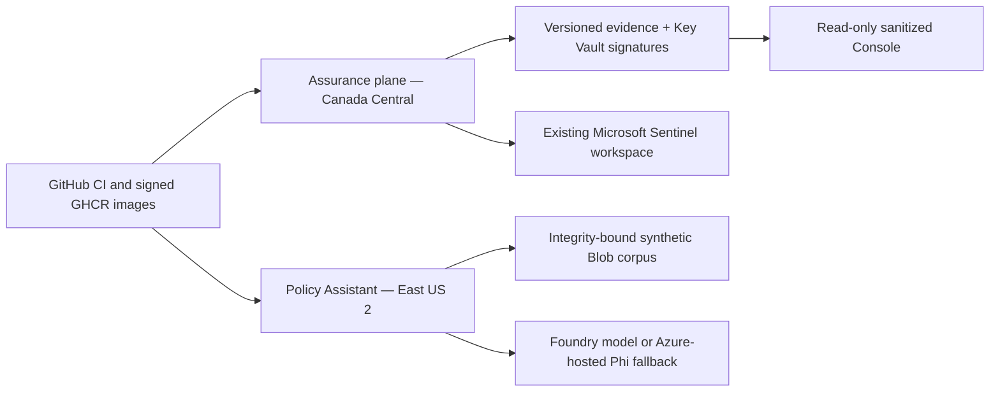

# Azure AI Continuous Assurance

An evidence-first continuous internal-assurance and audit-readiness simulation for a small Azure-hosted policy assistant. It turns cloud, CI, identity, telemetry, and fixed AI-evaluation evidence into traceable control conclusions, findings, risks, remediation records, retests, and signed OSCAL packages.

> **Internal readiness assessment—not certification, attestation, or independent audit.** All organizations, users, policies, tickets, and attack scenarios are synthetic.

## What is implemented

- A 25-control profile with 35 tailored objectives: 19 automated, 8 hybrid, and 8 manual.
- A headless Python pipeline that collects versioned evidence, fails closed on missing/stale/unauthorized data, evaluates deterministic rules, preserves retest history, and emits private plus sanitized packages.
- A strict, version-controlled runtime system record covering boundary, data flows, trust boundaries, inventory, identities, classifications, shared responsibility, and exclusions; every private and sanitized package carries the exact assessed record.
- Two locally signed, mutation-verifiable sample packages showing a baseline and remediated/retest state.
- A manifest cost contract that records model, compute, storage, and telemetry estimates in CAD and rejects totals that do not equal their component sum.
- Nine OSCAL v1.2.2 documents validated against the bundled checksum-pinned official NIST complete schema.
- A read-only public Assurance Console generated from those exact signed samples, plus a separate Entra-protected private command surface.
- A deliberately small Policy Assistant with deterministic FTS5 retrieval, Blob-corpus integrity checks, citations, content-minimized telemetry, a read-only lookup tool, and a server-issued single-use confirmation token for its harmless synthetic action.
- Bicep for separate control, SUT, fixture, and existing-Sentinel boundaries; least-privilege managed identities; Key Vault ES256 signing; versioned Blob evidence; Table command/event stores; budget; DCR; four Sentinel rules; and one workbook.



## Measured checked-in results

| Gate | Result |
|---|---:|
| Control profile | 25 controls / 35 objectives |
| Deterministic checks | 19 |
| Behavioral replay set | 50/50 contract outcomes |
| Mapping benchmark | 72 AI-assisted label candidates; precision 0.9444; citation validity 1.0000 |
| Signed public samples | 2 |
| Strict OSCAL documents | 9 |
| Safe scenario specifications | 8 |

Replay results prove the evaluation harness and public traceability demo, not live-model quality. The mapping labels require recorded human review before they may be called human-labeled.

The replay artifact is produced by executing every case through the assistant service rather than copying expected outcomes. See [controlled behavioral evaluations](docs/operations/behavioral-evaluations.md) for deterministic generation and the separate Foundry/Phi live smoke gate.

## Trace the baseline-to-retest story

1. Open the baseline sample and select a failed objective.
2. Follow test result → exact evidence digest → observation → finding → risk.
3. Inspect the linked remediation and immutable historical record.
4. Compare the remediated run and its signed `assessment-diff.json`.
5. Verify either package offline with `assure verify --manifest ...`.

The public Console is the portfolio centerpiece; the assistant is intentionally only large enough to produce authentic identity, retrieval, tool-authorization, logging, prompt-injection, and release-gate evidence.

## Local verification

```bash
python3 -m venv .venv
.venv/bin/python -m pip install -e '.[dev]'
npm ci

.venv/bin/ruff check src tests assurance/scripts scripts/azure sentinel/tests
.venv/bin/mypy src
.venv/bin/pytest
PYTHONPATH=src .venv/bin/python assurance/scripts/validate_contracts.py
PYTHONPATH=src .venv/bin/python assurance/scripts/validate_oscal.py
PYTHONPATH=src .venv/bin/python assurance/scripts/validate_artifacts.py
.venv/bin/python -m aica.cli evaluation generate --adapter replay --output /tmp/aica-replay-results.json
.venv/bin/python -m aica.cli evaluation behavioral --results /tmp/aica-replay-results.json
npm test
npm run build
```

Use `assure --help` for the headless lifecycle. Azure mutations are intentionally performed only through Azure MCP after Bicep compilation and a reviewed What-If; the repository contains no click-only production configuration.

## Read next

- [Architecture](docs/architecture.md)
- [Release readiness and externally observed gates](docs/release-readiness.md)
- [Limitations and non-claims](docs/limitations.md)
- [Assurance artifact index](assurance/ARTIFACT_INDEX.md)
- [AI usage disclosure](AI_USAGE.md)
- [Azure deployment protocol](infra/README.md)
- [Corpus and Entra Azure MCP handoffs](docs/operations/azure-deployment-handoffs.md)
- [Controlled behavioral evaluations](docs/operations/behavioral-evaluations.md)
