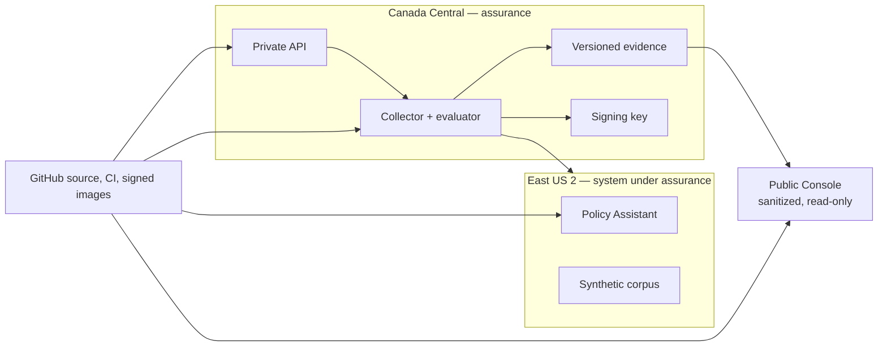

# Azure AI Continuous Assurance

[](https://github.com/ymangt/azure-ai-continuous-assurance/actions/workflows/ci.yml)
[](https://github.com/ymangt/azure-ai-continuous-assurance/actions/workflows/security.yml)
[](https://github.com/ymangt/azure-ai-continuous-assurance/actions/workflows/supply-chain.yml)

A portfolio project that shows what **continuous assurance** can look like for a small Azure-hosted AI app: collect evidence, test controls, keep failures visible, prove the fix, retest with fresh evidence, and leave behind a package someone else can verify.

The “app under review” is a synthetic Policy Assistant — grounded policy Q&A with citations, guardrails, and a confirmation-gated action. The interesting part is not the assistant itself. It is the assurance loop around it.

> This is an internal-readiness / portfolio demo, not a certification, attestation, penetration test, or independent audit. Organizations, people, tickets, incidents, prompts, and attack scenarios are synthetic. One author simulates several audit and management roles.

## Why it exists

Traditional audits are periodic: someone asks for evidence, tests requirements, documents gaps, and writes a report. Continuous assurance asks whether you can do that reasoning repeatedly — with trustworthy evidence and a trail that does not quietly rewrite history.

This project is built around that chain:

```text
scope → control → test → evidence → result → finding → risk → remediation → retest → human decision
```

The browser is a workbench for reading those records and submitting commands. It does not collect Azure evidence, decide control results, or overwrite signed history.

## What you get

| Surface | What it is for |
|---|---|
| **Assurance Console** | Browse assessments, controls, evidence, findings, risks, runs, AI evaluations, and system scope |
| **Policy Assistant** | A small AI surface that produces realistic grounding, injection, authorization, and telemetry evidence |
| **`assure` CLI** | Collect, evaluate, compare, report, publish, and verify signed packages offline |
| **FastAPI service** | Serve signed packages and accept authenticated reviewer commands |
| **Azure source** | Bicep for separated assurance, system-under-test, fixture, and existing-Sentinel boundaries |

### Checked-in numbers

| | |
|---|---:|
| Controls / objectives | 25 / 35 (19 automated, 8 hybrid, 8 manual) |
| Control sources | 20 NIST SP 800-53 + 5 project AI controls |
| Signed sample packages | 2 (baseline + remediated/retest) |
| OSCAL v1.2.2 documents | 9 (validated against a checksum-pinned official schema) |
| Behavioral replay | 50/50 expected outcomes |
| Mapping benchmark | 72 candidates · precision 0.9444 · citation validity 1.0 |
| Synthetic policy corpus | 18 documents |
| Controlled scenarios | 8 (`SCN-001` … `SCN-008`) |

These numbers prove the checked-in harnesses and sample lifecycle. They do not prove live Azure operating effectiveness or live-model quality. See [limitations](docs/limitations.md) and [release readiness](docs/release-readiness.md).

## Try it locally

**Prerequisites:** Node.js 22+, npm. Python 3.12+ for the API and CLI.

### Fastest start: Assurance Console

```bash
git clone https://github.com/ymangt/azure-ai-continuous-assurance.git
cd azure-ai-continuous-assurance
npm ci
npm run dev --workspace @aica/assurance-console
```

Open [http://localhost:4173](http://localhost:4173).

This loads the two checked-in signed sample packages. Command buttons produce demo receipts only — they do not start Azure jobs or permanently change the samples.

Useful states: `?state=loading|empty|error|stale`, `?mode=public`, and hash routes like `#controls` or `#evidence`.

### Policy Assistant (second terminal)

```bash
npm run dev --workspace @aica/policy-assistant
```

Open [http://localhost:4174](http://localhost:4174). Default mode uses deterministic replay fixtures, so no live model call is required.

### API + CLI (optional)

```bash
python3 -m venv .venv
.venv/bin/python -m pip install -e '.[dev]'
.venv/bin/aica-api
```

Then point the Console at the API:

```bash
VITE_DATA_SOURCE=api npm run dev --workspace @aica/assurance-console
```

The API defaults to public mode (`AICA_PUBLIC_MODE=true`), so command endpoints stay disabled.

Common CLI commands after install:

```bash
.venv/bin/assure collect --profile replay
.venv/bin/assure diff \
  --from 018f6d9a-7b10-7c01-8000-000000000001 \
  --to 018f6d9a-7b10-7c01-8000-000000000002
.venv/bin/assure verify \
  --manifest data/sample-runs/remediated/run-manifest.json
```

More detail: [Assurance Console](apps/console/README.md), [Policy Assistant](apps/policy-assistant/README.md).

## See it work: open RDP → fix → retest

The signed samples tell a complete `SC-7.1` story (no Internet administrative ingress):

1. **Baseline:** a safe, unattached fixture NSG allows Any → TCP/3389 → test **FAIL**
2. **Finding / risk:** `FND-001` (HIGH) and `RSK-001` (inherent 12/25)
3. **Remediation:** remove the rule through version-controlled infrastructure
4. **Retest:** fresh evidence → **PASS**; residual risk drops to 3/25
5. **Closure:** a reviewer accepts the close recommendation — the original failure stays in history

In the Console, start on Overview and follow the criteria-to-retest trace, or jump Controls → Evidence → Findings & Risks → Assessment Runs and compare the two signed packages.

The same samples also close three AI-related findings (grounding / injection, tool confirmation, release-gate digests). One moderate residual remains intentionally open: authenticated public endpoints under the student cost profile (`SC-7.2` / `EXC-001`).

## Design choices worth knowing

- **Fail closed.** Missing, stale, unauthorized, malformed, or failed required evidence becomes ERROR or NOT_CONCLUDED — never a false PASS.
- **Signed packages.** Manifest digests, independent private/public hashes, and offline `assure verify`. Checked-in samples use a `local://` key; they do not claim Azure Key Vault provenance.
- **Immutable lifecycle.** A fix creates remediation and retest records. It does not delete the original failure.
- **Public vs private.** The public Console is sanitized and read-only. Private commands require Entra identity and server-side app roles.
- **AI is constrained.** Model output cannot authorize tools, conclude controls, accept risk, or close findings. Mappings stay `SUGGESTED` until a human accepts or rejects them.
- **Two Azure planes.** Canada Central holds the assurance control plane; East US 2 holds the synthetic Policy Assistant. Collectors use read-only assessed-scope identities.
- **Student-cost profile.** CAD $25/month planning ceiling — no private endpoints, NAT Gateway, Firewall, or paid Defender under this profile.



## What is real today vs still pending

**Complete in the repository:** deterministic local/replay pipeline, two signed sample packages, Console and Policy Assistant builds, OSCAL validation, security/public-boundary/supply-chain gates, and deployment-ready Azure handoffs.

**Still needs live or human evidence:** foundation What-If/deployment, corpus and Entra materialization readbacks, deployed authorization probes, live Foundry or Phi evaluation, eight live failure campaigns, 14 days / 10 scheduled runs, attributed review of the 72 mapping labels, and an external walkthrough.

Honest claim until then:

> Fully tested local/replay assurance implementation with deployment-ready Azure handoffs — not demonstrated long-term live operating effectiveness.

## How I'd explain this in thirty seconds

> I built an evidence-first continuous-assurance system around a synthetic Azure AI policy assistant. It defines 35 testable objectives, collects versioned cloud and CI evidence, fails closed when evidence is missing or stale, evaluates deterministic rules, and preserves the full finding → remediation → retest history. The React Console makes every conclusion traceable to evidence; signed manifests and OSCAL outputs make the packages portable. I keep a hard line between the tested local/replay implementation and any live operating-effectiveness claim.

## Further reading

- [Architecture](docs/architecture.md)
- [Limitations and non-claims](docs/limitations.md)
- [Release readiness](docs/release-readiness.md)
- [Assessment runbook](docs/operations/assessment-runbook.md)
- [Evidence integrity](docs/operations/evidence-integrity.md)
- [Threat model](docs/threat-model.md)
- [Framework crosswalk](docs/framework-crosswalk.md)
- [Shared responsibility](docs/shared-responsibility.md)
- [Cost model](docs/cost-model.md)
- [Assurance artifact index](assurance/ARTIFACT_INDEX.md)
- [AI usage disclosure](AI_USAGE.md)
- [Azure infrastructure](infra/README.md)
- [GitHub environments and trust setup](.github/README.md)

## License

MIT — see [`pyproject.toml`](pyproject.toml).
