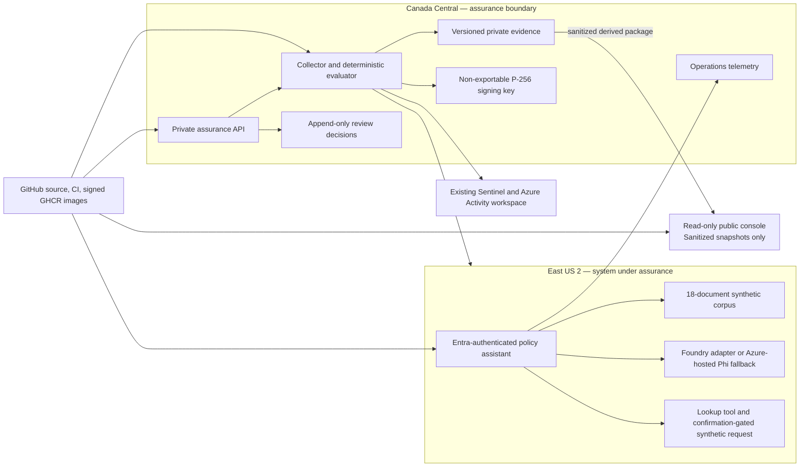
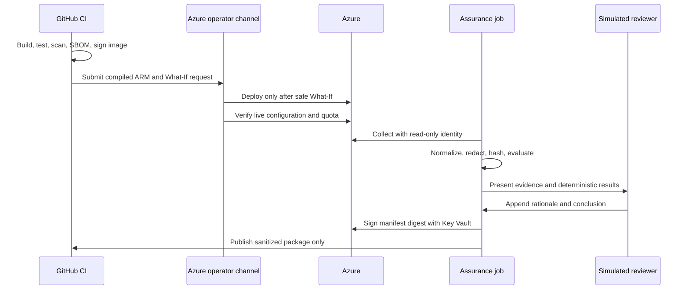

# Security and assurance architecture

## Purpose

Azure AI Continuous Assurance contains two deliberately separate planes: a small synthetic policy assistant and a headless assurance service. The browser displays derived records and queues commands; it does not decide control results or overwrite signed artifacts.

## Trust boundaries

1. The public console is untrusted, read-only, and receives no Azure credential or private resource identifier.
2. Private reviewer commands cross Entra authentication and server-side authorization before an append-only decision event is created.
3. The collector uses a distinct read-only assessed-scope identity and a single-repository, read-only GitHub App installation token; it may write only to private evidence storage.
4. Retrieved corpus text crosses an AI data trust boundary and is always treated as untrusted data.
5. Model-requested tools cross a server authorization boundary; model output is never authorization.
6. Private evidence crosses a sanitization boundary before public release. Private and sanitized forms receive independent hashes.
7. A Key Vault P-256 key signs a manifest digest. Versioning and soft delete make the result tamper-evident, not tamper-proof.

## Identity separation

- Bootstrap: creates identities, federation, and role assignments only.
- GitHub deploy: contributor within project resource groups; cannot grant roles.
- Assistant: reads the synthetic corpus and invokes the selected model.
- Collector: reads assessed scopes and logs; mints one-repository GitHub App tokens with `Administration: read`, `Actions: read`, and `Code scanning alerts: read`; performs read-only API denial probes; writes private evidence only.
- Console: reads derived evidence and appends review decisions.
- Sentinel content: manages version-controlled content only in the existing security resource group.

The solo author operates simulated assessor, owner, and approver personas. Logs and reports never imply organizational independence.

## Runtime system record

`config/system-record.json` is the version-controlled runtime source for the authorization boundary, data flows, trust boundaries, inventory, identities, classifications, shared-responsibility statement, and explicit exclusions. The pipeline validates it with the strict `SystemRecord` contract before evaluation and embeds it in both the private package and sanitized public derivative. The Console renders the selected package record; it does not reconstruct boundary facts from UI fixture data.

## Deployment and assurance sequence

## Non-deployed enterprise target state

For production or non-synthetic data, add private endpoints, network-isolated model and storage access, centralized production identity governance, independent reviewers, immutable retention where required, production incident on-call, and organization-approved data loss prevention. Those controls are intentionally not claimed by this student-cost implementation.
