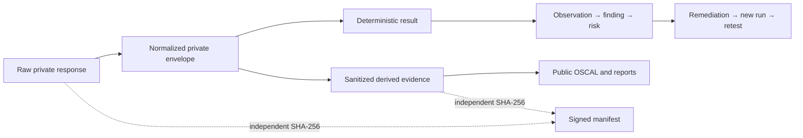

# Data flow and classification

## Flow inventory

| Flow | Source → destination | Data | Classification | Protection | Retention |
|---|---|---|---|---|---|
| F-01 | Git repository → corpus Blob/FTS5 | 18 synthetic policies and manifest | Internal synthetic | TLS, workload identity, hash manifest | While project active |
| F-02 | User → policy assistant | Synthetic policy question and pseudonymous session | Controlled in transit | Entra, TLS, rate limit | Raw content not in routine logs |
| F-03 | Assistant → model adapter | Grounded synthetic context and question | Controlled Evaluation | Managed identity or isolated Azure-hosted runtime | Request content retained only for controlled tests |
| F-04 | Assistant → lookup tool | Policy ID/section | Internal synthetic | Server authorization, schema validation | Operational metadata 30 days |
| F-05 | Assistant → consequential tool | Synthetic request fields and confirmation binding | Internal synthetic | Independent authorization, single-use confirmation | Synthetic record until scenario cleanup |
| F-06 | Assistant → operations logs | Evaluation ID, pseudonyms, model, retrieval IDs, outcome, latency, tokens, guardrail/tool state | Internal | TLS, workspace RBAC, content denylist | 30 days |
| F-07 | Azure/GitHub/Sentinel → collector | Configuration, role, diagnostic, query, and CI evidence | Restricted Assurance | Read-only identities; one-repository GitHub App token; TLS | Raw private evidence 365 days target |
| F-08 | Collector → evidence Blob | Raw and normalized evidence envelopes | Restricted Assurance | RBAC, encryption, versioning, soft delete | 365 days target |
| F-09 | Evaluator → lifecycle records | Results, observations, findings, risks, remediation, retests | Restricted Assurance | Deterministic rules, append-only semantics | 365 days target |
| F-10 | Reviewer → decision table | Identity, prior state, decision, rationale, artifact hash | Restricted Assurance | Entra, optimistic concurrency, append only | 365 days target |
| F-11 | Job → Key Vault | SHA-256 manifest digest | Internal integrity metadata | Managed identity; non-exportable key | Key/version retained while packages need verification |
| F-12 | Sanitizer → public console | Sanitized summaries, hashes, OSCAL, reports | Public | Denylist/leak tests; independent hash | Repository release retention |

## Content-minimized AI event

The versioned ingestion contract is `schemas/operational-telemetry.schema.json`. It allows only event/correlation/evaluation IDs, pseudonymous actor and session IDs, model and deployment version, retrieved document IDs and classifications (never excerpts), latency, token counts, interaction status, guardrail outcomes, requested tool, authorization decision, confirmation state, and tool result status. One record is emitted for every completed interaction, including interactions that do not request a tool; nullable tool fields are retained as explicit `null` values.

Prohibited routine fields: prompt, response, citation excerpt, retrieved content, access/confirmation token, secret, email, tenant/subscription ID, full private resource ID, IP address, or controlled adversarial payload. The closed JSON Schema and publisher denylist independently enforce this boundary.

## Evidence layers

The public layer is a derivative, never a substitute for private audit evidence. Private and public hashes are intentionally different.
